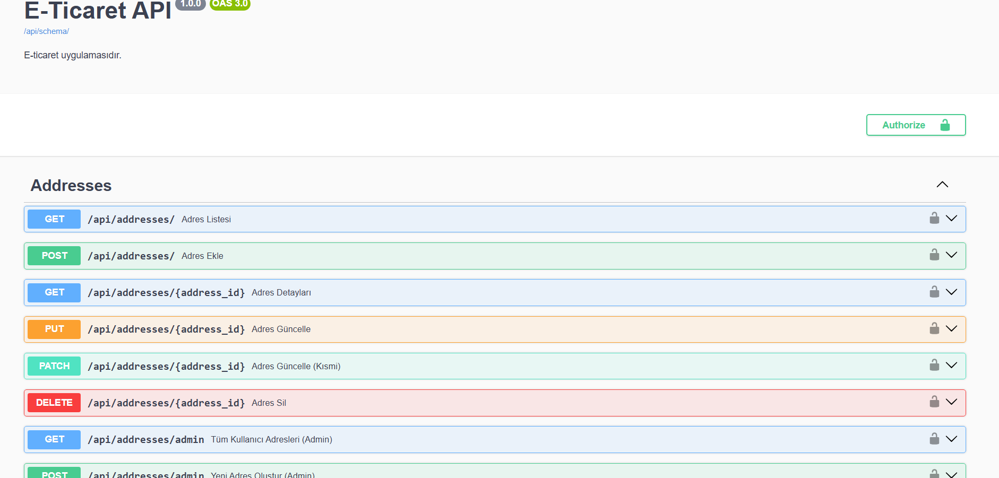
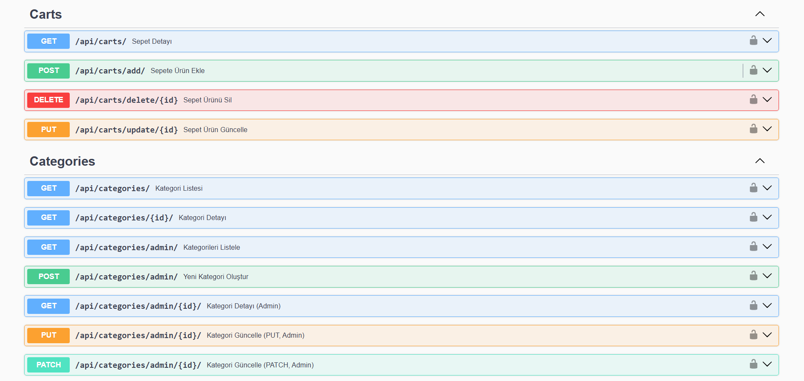
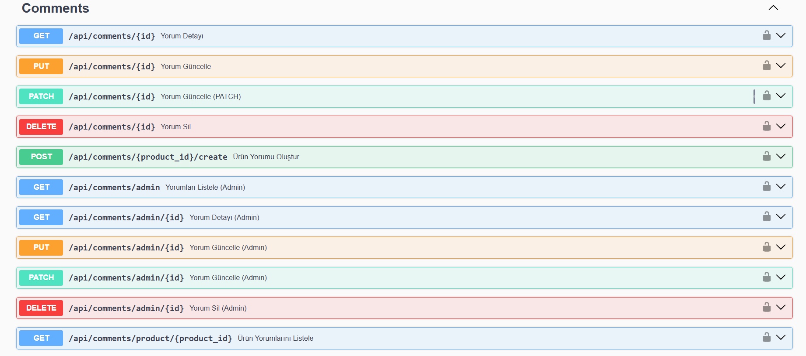
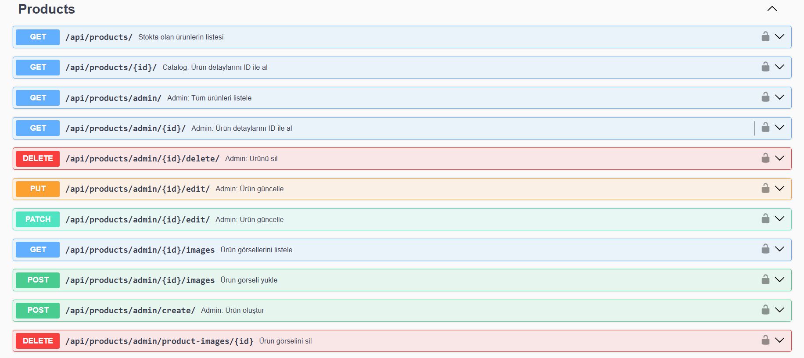
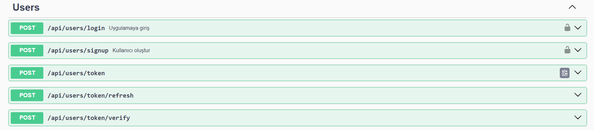
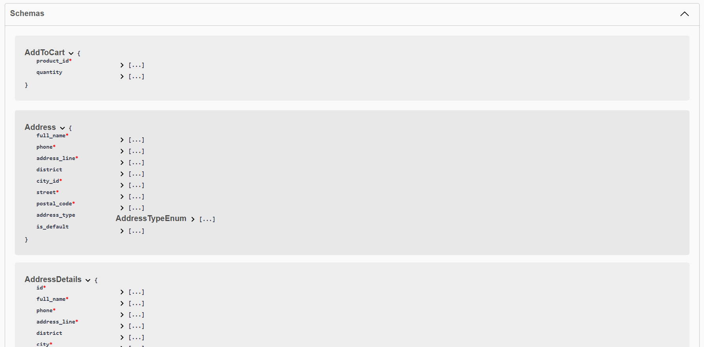
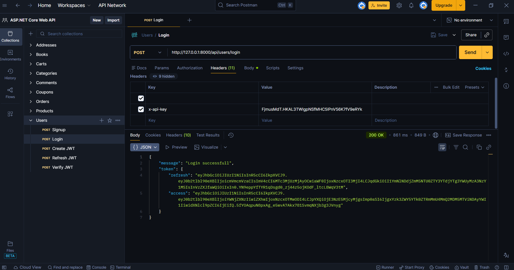

# 🚀 Django RESTful API Backend Project

Bu proje Django ve Django REST Framework kullanılarak geliştirilmiş RESTful API tabanlı bir backend uygulamasıdır.  
Kullanıcı yönetimi, ürün işlemleri, admin paneli ve temel e-ticaret mantığını içeren modüler bir API mimarisi üzerine kurulmuştur.

---

## 🛠️ Kullanılan Teknolojiler

- Python
- Django
- Django REST Framework
- PostgreSQL
- JWT Authentication
- Pillow

---

## 🚀 Özellikler

- Kullanıcı kayıt ve giriş sistemi
- JWT tabanlı authentication
- Ürün listeleme ve filtreleme
- Admin ürün ekleme / silme / güncelleme
- Stok kontrol sistemi
- Image upload (ImageField)
- Hata yönetimi (Error Handling)
- RESTful API mimarisi

---

# ⚙️ Kurulum Adımları

## 1️⃣ Repoyu Klonlayın
```bash
git clone https://github.com/kullaniciadi/projeadi.git
cd projeadi

2️⃣ Sanal Ortam Oluşturun
python -m venv venv

3️⃣ Sanal Ortamı Aktif Edin
Windows:
venv\Scripts\activate
Mac / Linux:
source venv/bin/activate

4️⃣ Bağımlılıkları Yükleyin
pip install -r requirements.txt

5️⃣ Migration İşlemleri
python manage.py makemigrations
python manage.py migrate

6️⃣ Sunucuyu Çalıştırın
python manage.py runserver

🌐 Tarayıcıdan Erişim
http://127.0.0.1:8000/


# 📸 API Documentation & Screenshots

Below are Swagger and Postman screenshots demonstrating the core structure and functionality of the E-Commerce REST API.

## 🧾 Swagger – Address Endpoints


## 🛒 Swagger – Cart & Category Endpoints


## 💬 Swagger – Comment Endpoints


## 📦 Swagger – Product Management (Admin + Public)


## 👤 Swagger – User & JWT Authentication Endpoints


## 🧩 Swagger – Schema Models


## 🔐 Postman – JWT Login Example

